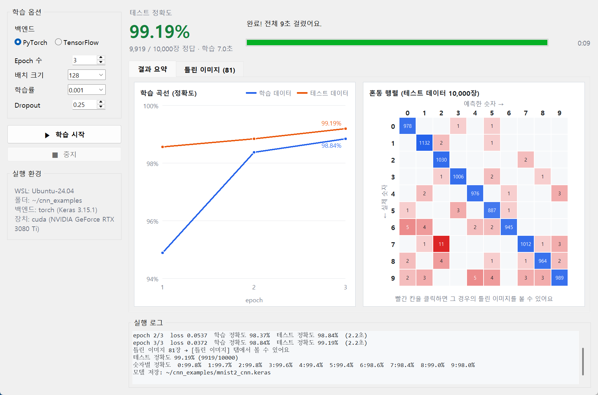
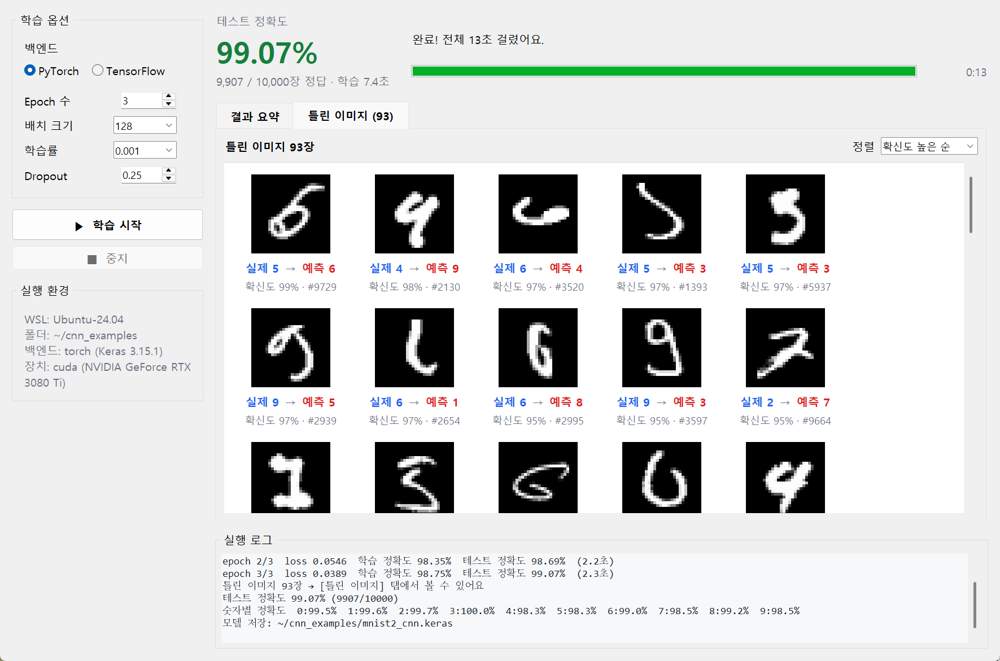
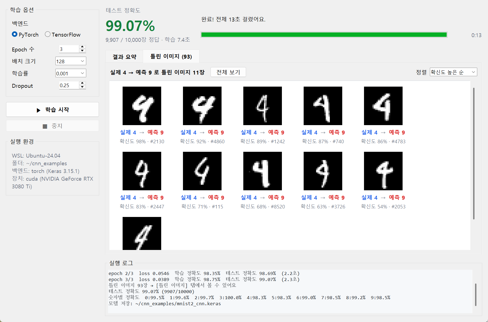
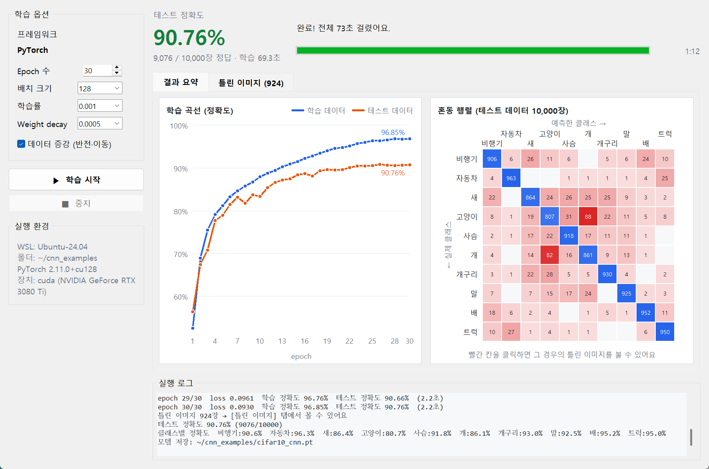
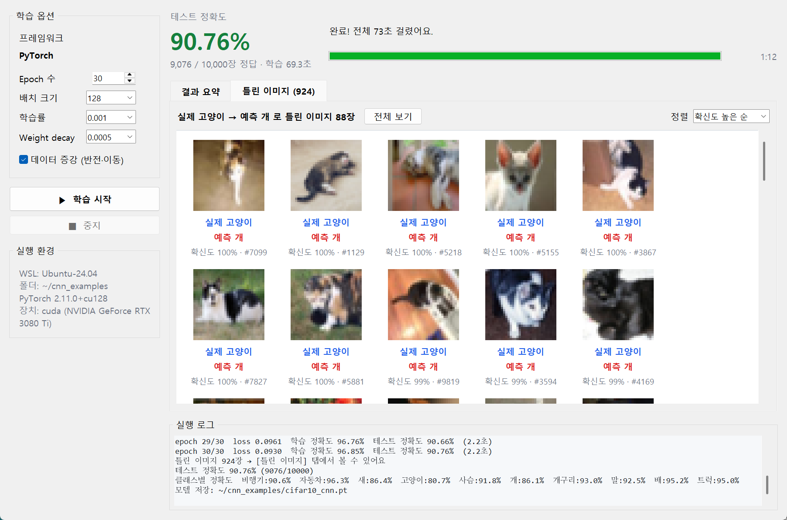

# MNIST Trainer

Windows 11 + WSL2(Ubuntu)의 NVIDIA GPU로 **MNIST**(손글씨 숫자)와 **CIFAR-10**(컬러 사진 10종) 분류 CNN을 학습하는 예제 모음입니다.
옵션을 바꿔 가며 학습하고, 결과(정확도, 학습 곡선, 혼동 행렬, 틀린 이미지)를 바로 볼 수 있는 **데스크톱 창 프로그램**이 포함되어 있습니다.

### MNIST 학습기



| 틀린 이미지 전체 | 혼동 행렬에서 "실제 4 → 예측 9" 칸을 클릭했을 때 |
|---|---|
|  |  |

### CIFAR-10 학습기 (30 epoch, 약 70초, 테스트 정확도 약 90.8%)

| 결과 요약 | 혼동 행렬에서 "실제 고양이 → 예측 개" 칸을 클릭했을 때 |
|---|---|
|  |  |

## 구성

| 파일 | 내용 |
|---|---|
| `mnist.py` | 순수 PyTorch CNN. 5 epoch에 테스트 정확도 약 99.1% |
| `mnist2.py` | 같은 CNN의 Keras 3 버전. 백엔드는 켜진 가상환경에 맞춰 자동 선택(`.venv` → torch, `.venv-tf` → tensorflow)되며 `KERAS_BACKEND`로 직접 지정도 가능. 혼동 행렬과 정확도 출력 |
| `cifar10_torch.py` | CIFAR-10용 VGG 스타일 CNN(합성곱 6층 + BatchNorm), 데이터 증강, AdamW + cosine 스케줄, bf16. 30 epoch에 약 90~91%, epoch당 약 2.3초 |
| `cifar10_keras.py` | 같은 모델의 Keras 3 버전 (TensorFlow 엔진 권장: PyTorch 엔진에서는 `RandomTranslation` 층이 매우 느림) |
| `max_resolution.py` | GPU 메모리로 처리 가능한 최대 입력 해상도 측정 (ResNet-50, ConvNeXt-Tiny / 추론·학습) |
| `jsonlog.py` | 학습 스크립트가 창 프로그램에 진행 상황을 보내는 공통 코드 (`--json` 옵션) |
| `gui/trainer_gui.py` | 창 프로그램 본체 (tkinter). 데이터셋별 설정(`PROFILES`)만 다름 |
| `gui/mnist_gui.pyw`, `gui/cifar10_gui.pyw` | 각 학습기 실행 파일 (`mnist2.py` / `cifar10_torch.py`를 WSL에서 실행) |
| `gui/make_icon.py` | 창 프로그램 아이콘(`mnist_gui.ico`, `cifar10_gui.ico`) 생성 |

## 창 프로그램 기능

- 학습 옵션 선택
  - MNIST: 프레임워크(Keras · PyTorch 엔진 / TensorFlow 엔진), epoch 수, 배치 크기, 학습률, dropout
  - CIFAR-10: epoch 수, 배치 크기, 학습률, weight decay, **데이터 증강 켜기/끄기** (끄면 과적합으로 정확도가 떨어지는 것을 비교해 볼 수 있음)
- 진행 바, epoch별 학습 곡선(학습/테스트 정확도)
- 테스트 정확도와 혼동 행렬 (빨간 칸을 클릭하면 해당 경우의 틀린 이미지만 표시)
- **틀린 이미지** 탭: 실제 → 예측 클래스, 확신도, 테스트 이미지 번호. 확신도·실제·예측 순으로 정렬, 200장씩 "더 보기"
- 학습 중지, 실행 로그

## 설치

### 1. WSL (학습 환경)

NVIDIA 드라이버는 Windows에만 설치하면 됩니다 (WSL 안에는 설치하지 않음). [uv](https://docs.astral.sh/uv/)를 사용합니다.

```bash
curl -LsSf https://astral.sh/uv/install.sh | sh
git clone https://github.com/jsongb510-tech/mnist-trainer.git
cd mnist-trainer

# PyTorch 환경 (기본)
uv venv --python 3.12 .venv
uv pip install --python .venv/bin/python torch torchvision --index-url https://download.pytorch.org/whl/cu128
uv pip install --python .venv/bin/python keras
```

TensorFlow 백엔드도 쓰려면 별도 환경을 만듭니다 (PyTorch와 CUDA 라이브러리 버전이 달라 분리).

```bash
uv venv --python 3.12 .venv-tf
uv pip install --python .venv-tf/bin/python "tensorflow[and-cuda]"
```

TensorFlow가 pip으로 설치된 NVIDIA 라이브러리(`libcusolver` 등)를 스스로 찾지 못하는 경우가 있어,
`.venv-tf/bin/activate` 끝에 다음을 추가합니다.

```bash
_TF_OLD_LD_LIBRARY_PATH="${LD_LIBRARY_PATH:-}"
export LD_LIBRARY_PATH="$(ls -d "$VIRTUAL_ENV"/lib/python3.12/site-packages/nvidia/*/lib | paste -sd:)${LD_LIBRARY_PATH:+:$LD_LIBRARY_PATH}"
eval "_tf_orig_$(declare -f deactivate)"
deactivate () {
    export LD_LIBRARY_PATH="$_TF_OLD_LD_LIBRARY_PATH"
    [ -z "$LD_LIBRARY_PATH" ] && unset LD_LIBRARY_PATH
    unset _TF_OLD_LD_LIBRARY_PATH
    _tf_orig_deactivate "$@"
}
```

### 2. Windows (창 프로그램)

Windows용 Python 3.12와 Pillow가 필요합니다 (tkinter는 Python에 포함).

```bash
uv venv --python 3.12 C:\path\to\gui-venv
uv pip install --python C:\path\to\gui-venv\Scripts\python.exe pillow
```

창 프로그램은 **WSL 안의 저장소 경로로 실행**합니다. WSL 배포판 이름과 저장소 위치를 경로에서 자동으로 알아냅니다.

```bash
C:\path\to\gui-venv\Scripts\pythonw.exe \\wsl$\Ubuntu-24.04\home\<user>\mnist-trainer\gui\mnist_gui.pyw
C:\path\to\gui-venv\Scripts\pythonw.exe \\wsl$\Ubuntu-24.04\home\<user>\mnist-trainer\gui\cifar10_gui.pyw
```

바탕화면 바로 가기를 만들 때는 위 명령을 대상으로, 아이콘은 `gui/mnist_gui.ico` / `gui/cifar10_gui.ico`를 지정하면 됩니다
(아이콘 파일은 Windows 폴더에 복사해 두는 편이 안정적입니다).

## 명령줄에서 실행

```bash
source .venv/bin/activate
python mnist.py                                  # PyTorch
python mnist2.py --epochs 10 --lr 0.0003         # Keras (PyTorch 백엔드)
python cifar10_torch.py                          # CIFAR-10, PyTorch (30 epoch)
python cifar10_torch.py --no-augment             # 데이터 증강 없이
python max_resolution.py                         # 최대 해상도 측정

source .venv-tf/bin/activate
python mnist2.py                                 # Keras (TensorFlow 백엔드 자동 선택)
python cifar10_keras.py                          # CIFAR-10, Keras (TensorFlow 백엔드)
```

- `mnist2.py` 옵션: `--epochs`, `--batch-size`, `--lr`, `--dropout`, `--json`(창 프로그램용 출력)
- `cifar10_torch.py` 옵션: `--epochs`, `--batch-size`, `--lr`, `--weight-decay`, `--no-augment`, `--workers`, `--json`

## 측정 결과 (RTX 3080 Ti 12GB, fp16 혼합 정밀도)

| 모델 | 추론 (배치 1) | 학습 (배치 1) | 학습 (배치 8) |
|---|---|---|---|
| ResNet-50 | 9664 px | 3424 px | 1184 px |
| ConvNeXt-Tiny | 7744 px | 2880 px | 1024 px |

1000×1000 이미지는 ResNet-50으로 배치 11장까지 학습 가능 (약 29장/초).

## 라이선스

[MIT License](LICENSE) — 자유롭게 사용·수정·재배포할 수 있습니다 (저작권 표시와 라이선스 문구 유지).
